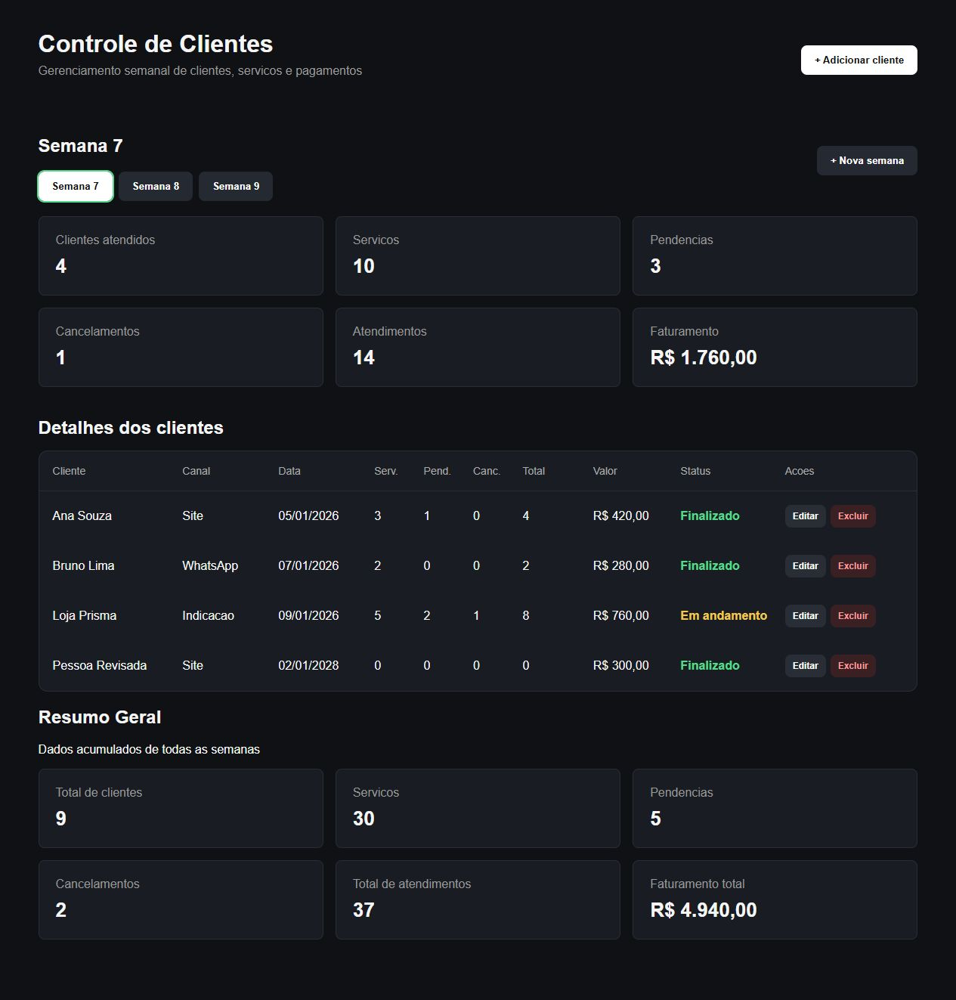
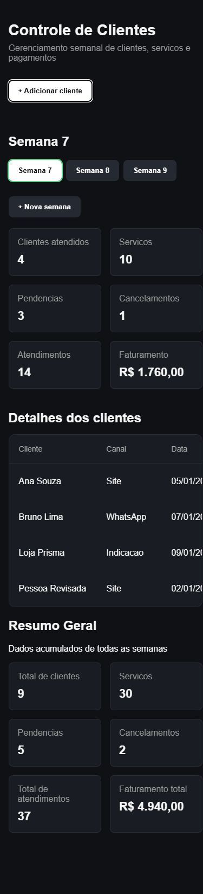

# Correções após revisão de código

Data: 06/10/2026.

## Escopo

Revisão e correção da cópia pública Controle de Clientes. O projeto privado original e seus bancos não foram alterados. O trabalho manteve React, TypeScript e Vite no frontend, Express no backend e SQLite na persistência.

## Problemas corrigidos

| Problema | Correção |
| --- | --- |
| API aceitava campos inválidos e retornava erros genéricos | Validação compartilhada de tipos, datas, opções e números; respostas 400, 404 e 409; triggers de proteção para novas gravações |
| Clique duplo podia cadastrar duas vezes | Bloqueio síncrono por ref e controles desabilitados durante as operações; ID gerado no SQLite |
| Erro ao recarregar após salvar ficava invisível | Aviso persistente, preservação dos dados anteriores e nova tentativa apenas da leitura |
| Migração podia ignorar registros silenciosamente | Validação completa antes da escrita, transação atômica e conflito explícito de IDs |
| Semana exibida podia divergir da usada no cadastro | Seleção reconciliada com as semanas da API e bloqueio de cadastro quando não existe semana |

Além disso, foi adicionado um índice para a listagem de clientes por semana e o ESLint passou a verificar também backend e testes JavaScript.

## Verificação automatizada

Ambiente: Windows, Node.js 24.21.0, npm 11.19.0.

| Comando | Resultado |
| --- | --- |
| `npm test` | 45 testes aprovados: 36 de API/SQLite/migração e 9 de React |
| `npm run lint` | Aprovado, sem erros |
| `npm run build` | Aprovado |

Os testes verificam CRUD HTTP, normalização/defaults, geração de IDs, conflitos, entradas inválidas sem alteração do banco, triggers SQL e atualização de esquema sem apagar registros legados. A importação é exercitada com arquivos inválidos, repetição idempotente e rollback inclusive dos registros que precedem um conflito.

Na interface, são testados seleção da semana 7, banco vazio, bloqueio de envios duplicados, avisos após gravação seguida de falha na leitura, nova tentativa, manutenção do formulário após rejeição da API, edição/exclusão e cancelamento da leitura inicial no StrictMode.

Os bancos e JSONs de teste são exclusivamente fictícios, ficam em diretórios temporários exclusivos e não são versionados.

## Conferência no navegador

Foi usada uma API conectada a um banco descartável separado do banco local da cópia de portfólio. O cadastro criou um registro fictício; a edição alterou nome e pagamento, e os dados permaneceram após recarregar. Após renumerar apenas as semanas desse banco descartável para 7, 8 e 9, a página exibiu e destacou corretamente a semana 7.

O painel foi conferido em viewport de 390 pixels. A largura do documento não ultrapassou a viewport, e os botões do cabeçalho/semanas permaneceram dentro da tela; a tabela mantém rolagem horizontal própria.

Nesta rodada, a ferramenta de navegador não conseguiu finalizar o diálogo nativo de confirmação da exclusão. A exclusão está aprovada tanto no teste de componente, que confirma o diálogo simulado, quanto no teste HTTP com SQLite real; não se registra essa tentativa manual como concluída. A conferência visual desta rodada cobre o painel, não uma nova validação completa do formulário no celular.

### Computador

### Celular

## Limites e segurança

Não foram validados outros sistemas operacionais, deploy público ou cenários de múltiplos usuários. O bloqueio de clique duplo é local à interface, não uma chave de idempotência entre diferentes dispositivos ou clientes HTTP.

A API continua sem autenticação/autorização. O código pode compor um portfólio no GitHub, mas uma API pública exige uma etapa adicional de segurança e infraestrutura. Bancos legados eventualmente contendo registros inválidos são preservados, sem limpeza automática.

## Etapas no histórico

1. Correções de validação, migração e interface, com testes automatizados e configuração de verificação.
2. Atualização do README e registro dos resultados/limitações, com capturas contendo apenas dados fictícios.

Essas etapas são acrescentadas ao histórico existente, sem reescrevê-lo.
