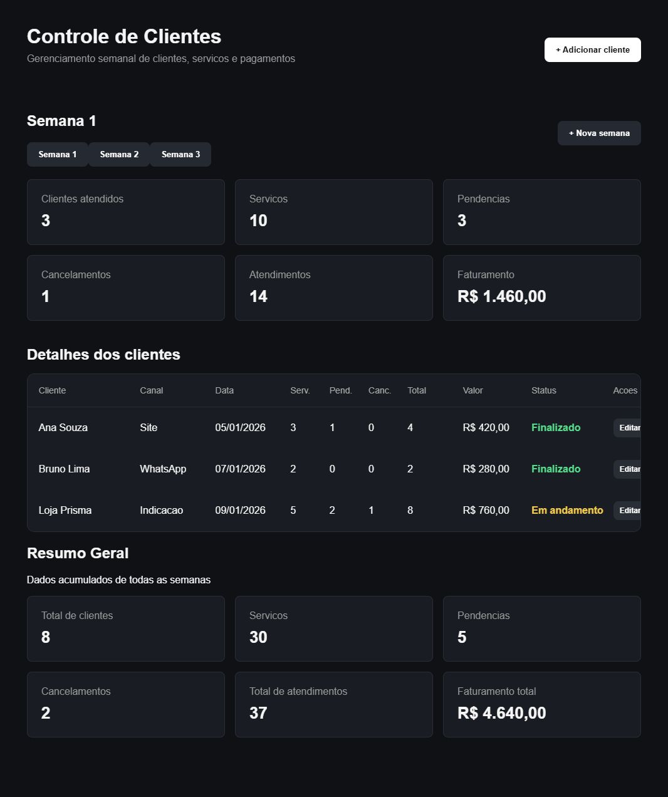
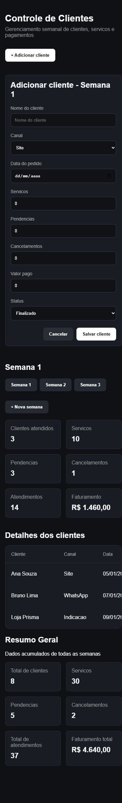

# Teste como visitante do repositorio

Data: 06/10/2026.

Este relatório registra a primeira simulação, anterior à publicação e à revisão de código. Para os resultados da versão corrigida, veja [Correções após revisão](correcoes-revisao.md).

## Cenario

Foi criada uma clonagem local limpa do repositorio de portfolio, somente com arquivos versionados. Nenhum banco, backup ou `node_modules` do projeto original foi utilizado. A simulacao reproduz o download do codigo pelo GitHub; o repositorio ainda nao foi publicado, portanto nao houve teste de acesso remoto ou de hospedagem.

Ambiente: Windows, Node.js 24.21.0, npm 11.19.0. A API foi executada na porta 3003 e o Vite na porta 5174, com `VITE_API_URL=http://localhost:3003`, para evitar conflito com outros servidores locais.

## Resultados

| Verificacao | Resultado |
| --- | --- |
| Instalacao tradicional com `npm install` | Falhou: tentativa de compilacao nativa do SQLite sem Visual Studio C++ |
| Instalacao usando binarios, com `--ignore-scripts` | Passou, sem dependencias copiadas de outro projeto |
| `npm run seed` | Passou: 3 semanas, 8 clientes ficticios |
| `npm run build` | Passou |
| `npm run lint` | Passou |
| Listagem e troca de semanas na interface | Passou |
| Cadastro de cliente na interface | Passou; linha e totais atualizados |
| Edicao de nome e valor na interface | Passou |
| Persistencia apos recarregar a pagina | Passou |
| Exclusao com confirmacao na interface | Passou; linha removida e totais atualizados |
| Criacao de nova semana | Passou; semana inicialmente vazia |
| Valor negativo no formulario | Bloqueado pela validacao HTML apos a correcao |
| CRUD diretamente na API | POST 201, GET com registro, PUT 200, DELETE 200 |
| Exclusao de registro inexistente | Resposta 404 |
| Formulario em tela de 390 pixels | Campos contidos na tela apos a correcao |

Os dados de teste foram restaurados com o seed ao terminar. A demonstracao voltou a ter oito clientes e faturamento total ficticio de R$ 4.640,00.

## Ajustes aplicados

- README com requisitos, download pelo GitHub, instalacao reproduzivel e dois terminais separados.
- Explicacao sobre portas ocupadas e configuracao do frontend.
- Aviso de que repetir o seed substitui os registros demonstrativos.
- Formulario responsivo: uma coluna no celular e controles sem ultrapassar a largura disponivel.
- Labels associados aos campos e envio por formulario, ativando campos obrigatorios e limites numericos do navegador.
- Mensagem de conexao sem presumir que a API sempre usa a porta 3001.

## Capturas

### Computador

### Celular: formulario

## Limites do teste

Foi validado o fluxo de demonstracao local neste ambiente. Nao foram testados outros sistemas operacionais, usuarios simultaneos ou deploy publico. Na versão inicial aqui registrada, a API não tinha validação completa de entradas. A revisão posterior adicionou validação no backend e testes automatizados; autenticação permanece como melhoria futura.

O GitHub apresenta os arquivos, o README e as capturas. Para experimentar a aplicacao, o visitante deve baixar o projeto e seguir o README. Uma demonstracao acessivel por link exige uma etapa posterior de hospedagem do frontend e da API.
